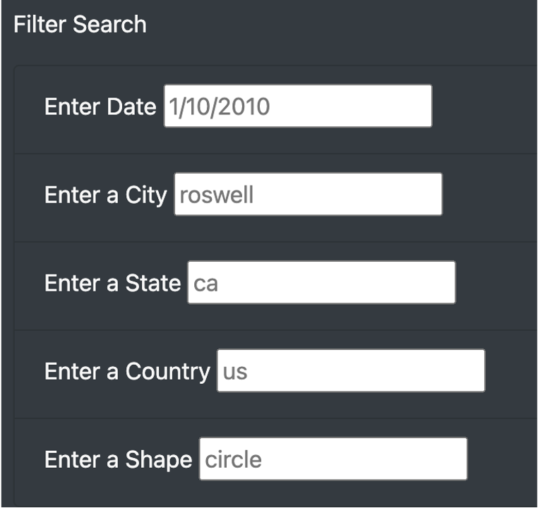
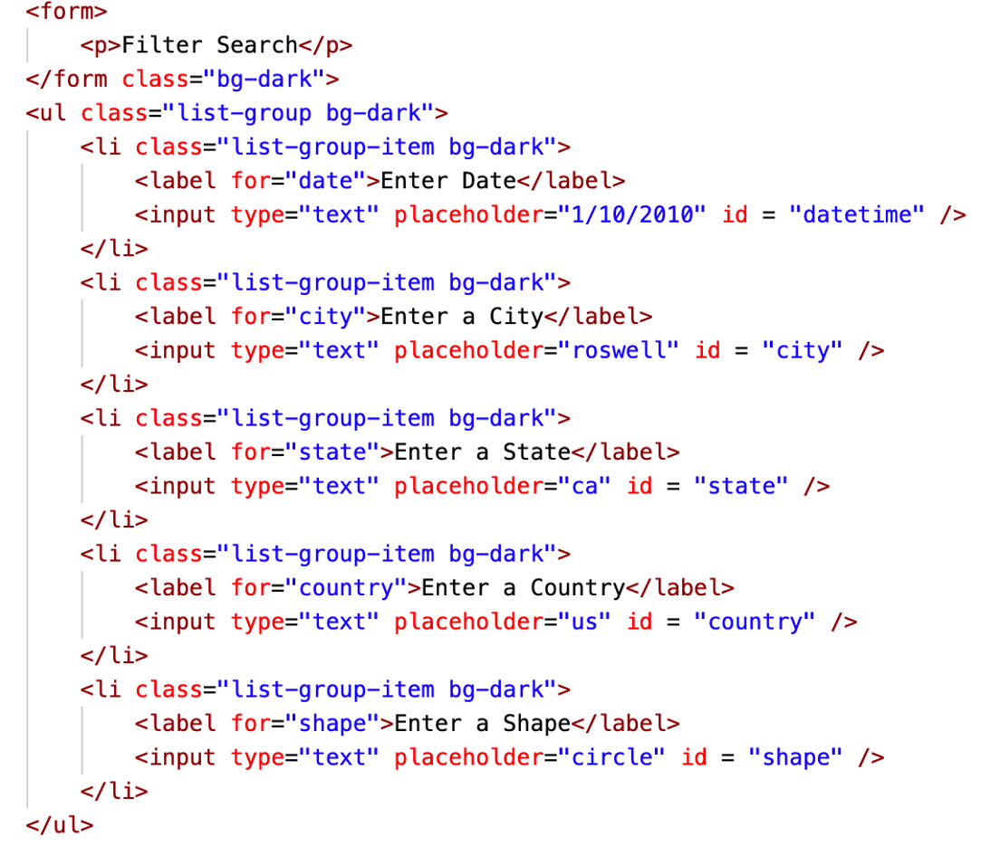
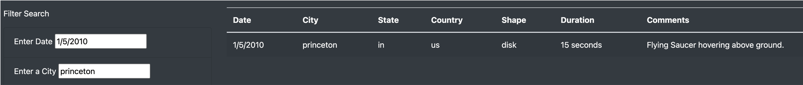

# UFO Challenge

## Module 11: HTML/Buttons/Javascript

### Purpose

The purpose of this challenge was to create a website to allow for a web user to see incidences of UFO sightings and filter through to find the data that they want. The data can be filtered by the following categories:
1. Date
2. City
3. State
4. Country
5. Shape

### Results

To use this webpage:
- Open index.html
- Note that all of the data for all UFO sightings is listed there
- To sort through and find the data that you want: note "Filter Search" on the bottom left
- Enter any data to narrow your search results
- Your search results will be updated in the table on the right

Below is a diagram of the Filter Search and the options:

To create these filtering options, I updated the <li> tag in our index.html file as you can see here:

Narrowed by the date "1/5/2010" and by the city "Princeton", you will see the following one result:

### Summary

#### Drawback of this new design:
  1. The new design does not include a keyword search, which would allow users to search through the data to find additional details about the UFO sightings.

#### Recommendations for further development:
  1. Create a keyword search filter button
  2. Create a "clear all filters" button so that users wouldn't have to manually clear text from each filter to start their search from the beginning.
